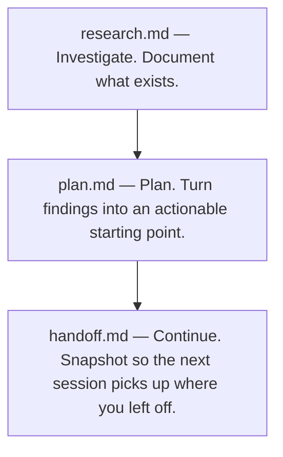

<p align="center">
  
</p>

<h3 align="center"><em>Context drifts if you don't pin it down</em></h3>

<p align="center">
  A lightweight system for maintaining context continuity across LLM sessions.
</p>

---

## The Problem

Most LLM-assisted work breaks down not because the model can't do the task, but because context gets stale or bloated mid-session. You lose track of what was investigated, what was decided, and where work stopped. Starting a new chat means starting from scratch — or spending half the session re-explaining what happened last time.

## The Solution

Three prompt files that create natural checkpoints across your workflow. Each session starts clean but informed, carrying forward only what the next session actually needs.

### Workflow



## Getting Started

Each prompt file is self-contained. For manual use, copy the one you need, paste it into your LLM conversation, and follow it with your actual request. No dependencies, no setup, no cloning required.

## Installing as a reusable skill

Some agents can load reusable skills from `~/.agents/skills`. For those tools, install Drift once:

```sh
mkdir -p ~/.agents/skills
git clone https://github.com/coylemichael/drift ~/.agents/skills/drift
```

Once installed, any agent that supports `~/.agents/skills` can load Drift from that location. The root `SKILL.md` acts as a router to `research.md`, `plan.md`, and `handoff.md`, so you manage one Drift skill directory instead of separate prompt installs.

For tools that use commands, rules, or prompt libraries instead, see the installation table below.

The model is intentionally split:

- The reusable Drift prompts live outside your target projects.
- Generated Drift artifacts live locally in each target project under `drift/<feature>/`.
- This avoids cloning Drift into every project you work on.

### 1. Research — understanding the codebase

**Paste [research.md](research.md), then ask your question.**

Example prompts:

- *"How does the authentication flow work?"*
- *"What happens when a user submits an endorsement?"*
- *"Map out the data flow from API request to database write for policy creation."*

The agent documents what exists — no unsolicited suggestions, no refactoring advice. It will ask for a feature identifier (ticket ref or slug) and save findings to `drift/<feature>/research/`.

### 2. Planning — turning research into a plan

**In a new session, paste [plan.md](plan.md), then point it at your research.**

> *"Read drift/auth-refactor/research/2026-03-30-auth-flow.md and create an implementation handoff."*

You get a concrete plan: which files to touch, in what order, with what constraints. The plan trusts the research — it won't re-read the codebase.

### 3. Continuing — picking up where you left off

Two actions, same prompt file.

**To snapshot the current session** — paste [handoff.md](handoff.md) into the running session:

> *"Write a handoff."*

**To resume in a new session** — paste [handoff.md](handoff.md) again, then point it at the snapshot:

> *"Read drift/auth-refactor/handoffs/2026-03-30_14-30-00_session-2.md and continue."*

Repeat until done. If the handoff chain exceeds three documents, summarize completed phases in the new handoff's `Status` section rather than asking the next session to read every prior link — the whole point of Drift is to keep context lean.

## When not to use Drift

Drift is overhead. It pays off when work spans sessions or touches code you don't fully hold in your head. Skip it for:

- **Trivial one-file changes** — typo fixes, dependency bumps, single-function tweaks
- **Throwaway scripts and prototypes** — anything you'd delete before merging
- **Exploratory spikes** — when you're still deciding whether to do the work at all
- **Work that fits comfortably in one session** — if you'll finish before context gets stale, the handoff is wasted effort

The research/plan/handoff loop earns its weight on multi-session work in unfamiliar code. Anything smaller, just do it.

### Where files are stored

All Drift artifacts live under `drift/<feature>/` at the root of your repository, where `<feature>` is a ticket reference (e.g., `PROJ-1234`) or a descriptive slug (e.g., `auth-refactor`). Each feature folder contains a `research/` subfolder and a `handoffs/` subfolder.

```
drift/
  auth-refactor/
    research/
      2026-03-30-auth-flow.md
    handoffs/
      2026-03-30_14-30-00_session-1.md
      2026-03-30_18-45-00_session-2.md
  PROJ-1234/
    research/
      ...
    handoffs/
      ...
```

The agent will ask you to confirm a feature identifier before writing the first artifact. Anything that uniquely identifies the work is fine.

These are project artifacts — they travel with the repo, not with your editor or user profile. Whether you commit them is up to you; add `drift/` to `.gitignore` if you prefer to keep them local.

### Where these work

These are plain markdown. Paste them into any agent or LLM — Zed, VS Code Copilot, Cursor, ChatGPT, Claude, Windsurf, or anything that accepts a system prompt. The YAML frontmatter at the top of each file is recognized by tools that support it and harmlessly ignored by those that don't.

### Installing as reusable commands or skills

Drift works pasted into any chat, and many tools support installing the prompts as reusable skills, slash commands, or rules:

| Tool | Location | Invocation |
|------|----------|------------|
| **Zed Agent** | `~/.agents/skills/drift` — clone the repo as-is so `SKILL.md` can route to `research.md`, `plan.md`, and `handoff.md` | Ask the agent to use the Drift skill |
| **VS Code Copilot Chat** | `.github/prompts/` — rename with the `.prompt.md` suffix (e.g. `research.md` → `.github/prompts/research.prompt.md`) | `/research`, `/plan`, `/handoff` |
| **Claude Code** | `.claude/commands/` — copy as-is (e.g. `research.md` → `.claude/commands/research.md`) | `/research`, `/plan`, `/handoff` |
| **Cursor** | `.cursor/rules/` — rename with the `.mdc` suffix (e.g. `research.md` → `.cursor/rules/research.mdc`) and adjust frontmatter to Cursor's `globs:` / `alwaysApply:` keys | Triggered by rule scope |
| **Anything else** | Paste the file contents directly into the chat | n/a |

The frontmatter is consumed by tools that understand it and ignored by those that don't — nothing breaks either way.