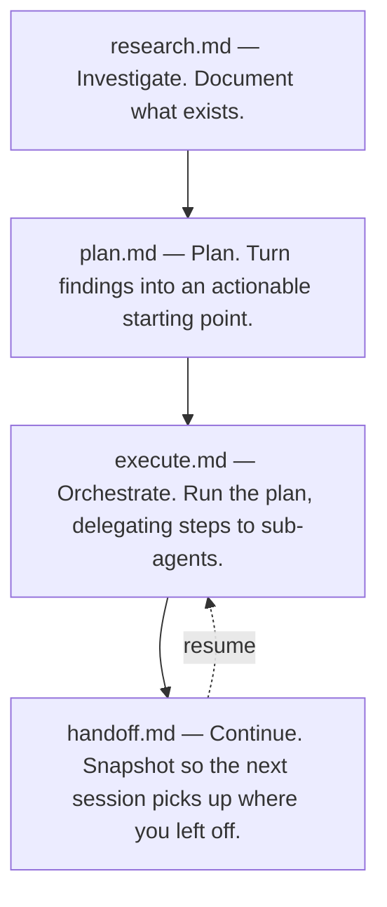

<p align="center">
  
</p>

<h3 align="center"><em>Context drifts if you don't pin it down</em></h3>

<p align="center">
  A lightweight system for maintaining context continuity across LLM sessions.
</p>

---

## The Problem

Most LLM-assisted work breaks down not because the model can't do the task, but because context gets stale or bloated mid-session. You lose track of what was investigated, what was decided, and where work stopped. Starting a new chat means starting from scratch — or spending half the session re-explaining what happened last time.

## The Solution

Four prompt files that create natural checkpoints across your workflow. Each session starts clean but informed, carrying forward only what the next session actually needs.

### Workflow



## Getting Started

Drift is designed as an agent **skill** by default: install it once in whatever location your agent uses for reusable skills, prompts, or commands, then invoke it by name from any project. The exact install path depends on the tool — jump to the [compatibility table](#installing-as-reusable-commands-or-skills) for step-by-step instructions per tool.

However your agent loads it, the root [`SKILL.md`](SKILL.md) acts as a router to [`research.md`](research.md), [`plan.md`](plan.md), [`execute.md`](execute.md), and [`handoff.md`](handoff.md), so you install Drift once and invoke it by name:

> *"Use Drift to research the auth flow."*

The model is intentionally split:

- The reusable Drift prompts live outside your target projects (wherever your agent stores skills).
- Generated Drift artifacts live locally in each target project under feature folders such as `drift/auth-refactor/`.
- Each feature folder contains numbered artifact files such as `001-research-auth-flow.md`, `002-plan-implementation.md`, and `003-handoff-session-1.md`.
- This avoids cloning Drift into every project you work on.

### No skill support? Use the files directly

Drift is just markdown, so it also works without any skill loader. Two options:

- **Point your agent at a file** — link one of the prompts (e.g. *"use https://github.com/coylemichael/drift/blob/main/research.md and research the auth flow"*) and let the agent fetch it.
- **Paste the file contents** — open [research.md](research.md), [plan.md](plan.md), [execute.md](execute.md), or [handoff.md](handoff.md), paste it into your chat, and follow with your request.

### 1. Research — understanding the codebase

**Ask Drift to research something.** Backed by [research.md](research.md) — paste it directly if your agent doesn't support skills.

Example prompts:

- *"How does the authentication flow work?"*
- *"What happens when a user submits an endorsement?"*
- *"Map out the data flow from API request to database write for policy creation."*

The agent documents what exists — no unsolicited suggestions, no refactoring advice. It will ask for a feature identifier (ticket ref or slug), allocate the next artifact number in that feature folder, and save findings as `drift/<feature>/NNN-research-<topic>.md`.

### 2. Planning — turning research into a plan

**In a new session, ask Drift to plan from your research.** Backed by [plan.md](plan.md).

> *"Use Drift to read drift/auth-refactor/001-research-auth-flow.md and create an implementation plan."*

You get a concrete plan: which files to touch, in what order, with what constraints. The plan trusts the research — it won't re-read the codebase. Steps are written to be self-contained enough for a sub-agent to pick up, which sets up the execute step.

### 3. Executing — running the plan with orchestration

**In a fresh session, ask Drift to execute a plan or a prior handoff.** Backed by [execute.md](execute.md).

> *"Use Drift to read drift/auth-refactor/002-plan-implementation.md and execute it."*

The session becomes an orchestrator: it walks the step sequence, delegates self-contained steps to sub-agents (in parallel where write scopes are disjoint), verifies each step, and writes a handoff at the end. Verification, tightly-coupled edits, and small one-shot changes stay with the orchestrator; larger scoped work gets delegated to keep the orchestrator's context lean.

Executing is optional — for small plans you can skip straight from `plan.md` to hands-on implementation and then to `handoff.md`. Execute earns its keep on longer plans where context bloat is a real risk. Legacy input paths (e.g. `drift/<feature>/handoffs/YYYY-MM-DD_HH-MM-SS_plan.md`) are supported; the resulting handoff is still written as the next flat numbered artifact in the feature folder.

### 4. Continuing — picking up where you left off

Two actions, same prompt file — backed by [handoff.md](handoff.md).

**To snapshot the current session** — in the running session:

> *"Use Drift to write a handoff."*

**To resume in a new session** — point Drift at the snapshot:

> *"Use Drift to read drift/auth-refactor/003-handoff-session-2.md and continue."*

Repeat until done. If the handoff chain exceeds three documents, summarize completed phases in the new handoff's `Status` section rather than asking the next session to read every prior link — the whole point of Drift is to keep context lean.

## When not to use Drift

Drift is overhead. It pays off when work spans sessions or touches code you don't fully hold in your head. Skip it for:

- **Trivial one-file changes** — typo fixes, dependency bumps, single-function tweaks
- **Throwaway scripts and prototypes** — anything you'd delete before merging
- **Exploratory spikes** — when you're still deciding whether to do the work at all
- **Work that fits comfortably in one session** — if you'll finish before context gets stale, the handoff is wasted effort

The research/plan/handoff loop earns its weight on multi-session work in unfamiliar code. Anything smaller, just do it.

### Where files are stored

All Drift artifacts live under feature folders at the root of your repository. A feature folder is a ticket reference or descriptive slug, such as `auth-refactor` or `PROJ-1234`. Each artifact is a numbered markdown file directly inside that folder; Drift does not split research, plans, and handoffs into separate subfolders for new artifacts.

```
drift/
  auth-refactor/
    001-research-auth-flow.md
    002-plan-implementation.md
    003-handoff-session-1.md
    004-handoff-session-2.md
    005-research-edge-cases.md
    006-plan-follow-up.md
  PROJ-1234/
    001-research-policy-flow.md
    002-plan-policy-flow.md
```

The agent will ask you to confirm a feature identifier before writing the first artifact, scan existing `NNN-*` markdown files in `drift/<feature>/`, and allocate the next number. Anything that uniquely identifies the feature or work grouping is fine.

New work for the same feature gets a new numbered artifact in that feature folder rather than modifying an older artifact. Distinct features should get separate feature folders. Drift does not maintain `INDEX.md`, `CURRENT.md`, or status directories; file-tree navigation comes from feature folders and numbered artifact filenames.

These are project artifacts — they travel with the repo, not with your editor or user profile. Drift ensures the repository-root `.gitignore` contains `/drift/` before writing artifacts by default.

### Where these work

These are plain markdown. Paste them into any agent or LLM — Zed, VS Code Copilot, Cursor, ChatGPT, Claude, Windsurf, or anything that accepts a system prompt. The YAML frontmatter at the top of each file is recognized by tools that support it and harmlessly ignored by those that don't.

### Installing as reusable commands or skills

Installing Drift as a skill is the default operating model (see [Getting Started](#getting-started)). The exact install location depends on your tool:

| Tool | Location | Invocation |
|------|----------|------------|
| **Zed Agent** | `~/.agents/skills/drift` — clone the repo as-is so `SKILL.md` can route to `research.md`, `plan.md`, `execute.md`, and `handoff.md` | Ask the agent to use the Drift skill |
| **VS Code Copilot Chat** | `.github/prompts/` — rename with the `.prompt.md` suffix (e.g. `research.md` → `.github/prompts/research.prompt.md`) | `/research`, `/plan`, `/execute`, `/handoff` |
| **Claude Code** | `~/.claude/skills/drift` — clone the repo as-is so `SKILL.md` can route to `research.md`, `plan.md`, `execute.md`, and `handoff.md`. Use `.claude/skills/drift` instead to scope Drift to a single project | `/drift`, or ask Claude to use the Drift skill |
| **Cursor** | `.cursor/rules/` — rename with the `.mdc` suffix (e.g. `research.md` → `.cursor/rules/research.mdc`) and adjust frontmatter to Cursor's `globs:` / `alwaysApply:` keys | Triggered by rule scope |
| **Anything else** | Paste the file contents directly into the chat | n/a |

Claude Code discovers skills at session start, so restart the session after installing. Invoking `/drift` loads `SKILL.md`, which routes the request to the right prompt file — install Drift as one skill rather than four separate commands.

The frontmatter is consumed by tools that understand it and ignored by those that don't — nothing breaks either way.

### Developing Drift itself

If you're working on Drift's prompts and also using it as a skill, avoid maintaining two copies. Clone the repo wherever you keep projects and symlink the skill directory to it:

```sh
git clone https://github.com/coylemichael/drift ~/projects/drift
ln -s ~/projects/drift ~/.agents/skills/drift   # Zed Agent
ln -s ~/projects/drift ~/.claude/skills/drift   # Claude Code
```

Symlink whichever skill directories your tools use. Edits in the working clone are immediately live in the skill — useful for iterating on prompt wording and testing it via skill invocation in the same session. The tradeoff: half-finished edits or a checked-out feature branch are what the skill serves. Check out `main` (or stash) to return the skill to a known-good state.
